Bullet Scan Examples
================

## Breakoff

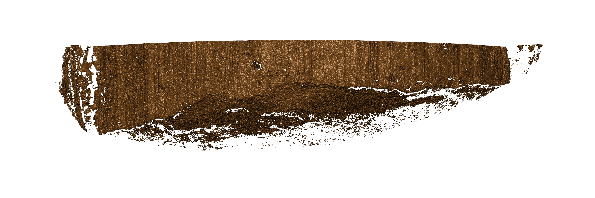<!-- -->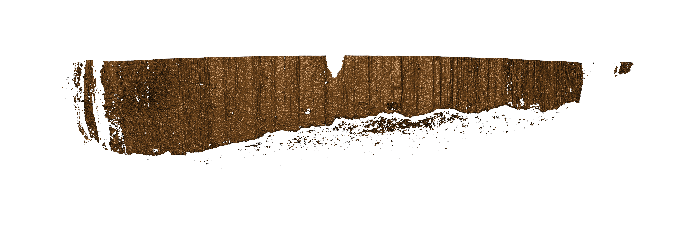<!-- -->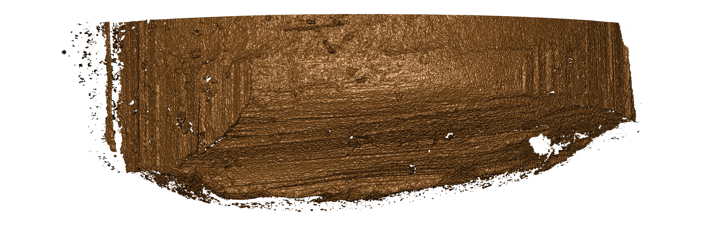<!-- -->

## Groove Engraved Areas

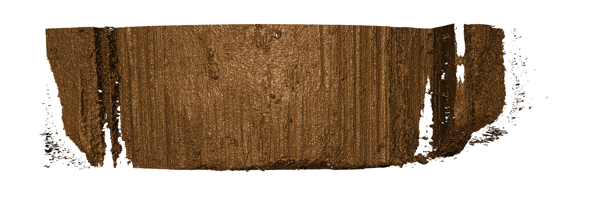<!-- -->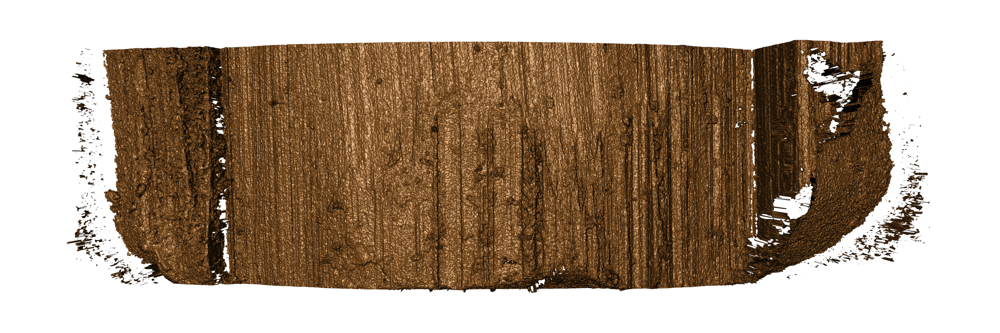<!-- -->

## Misaligned

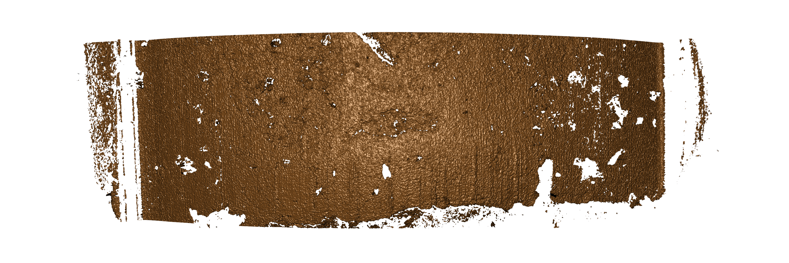<!-- -->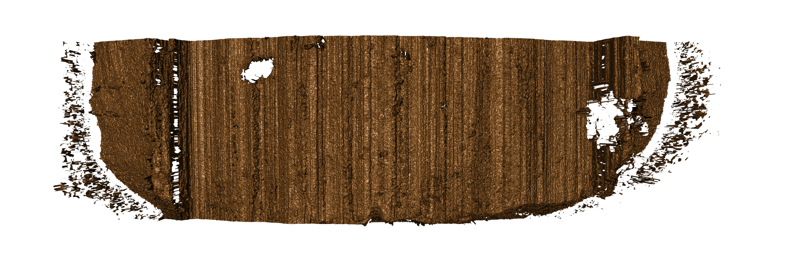<!-- -->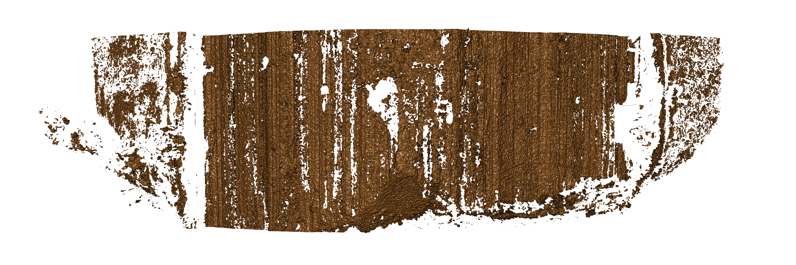<!-- -->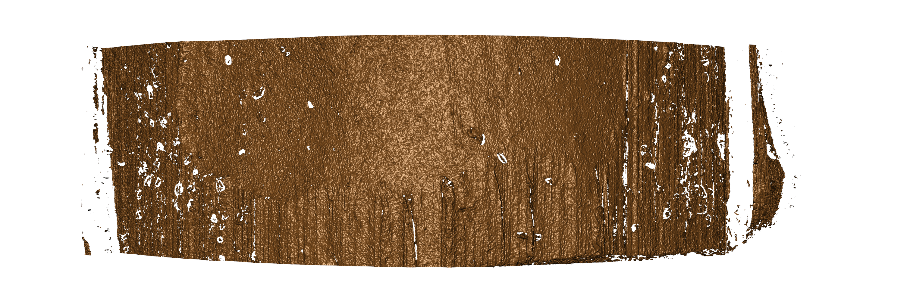<!-- -->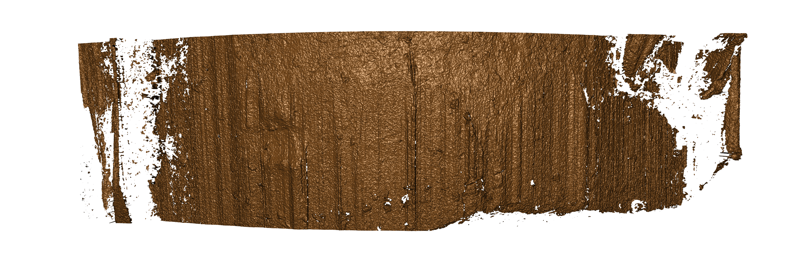<!-- -->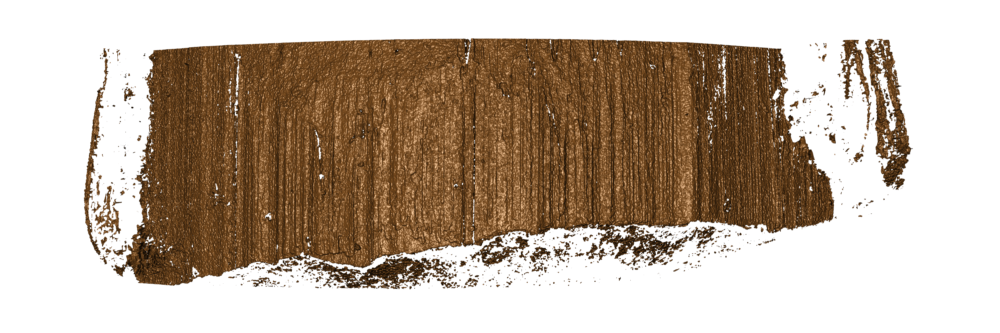<!-- -->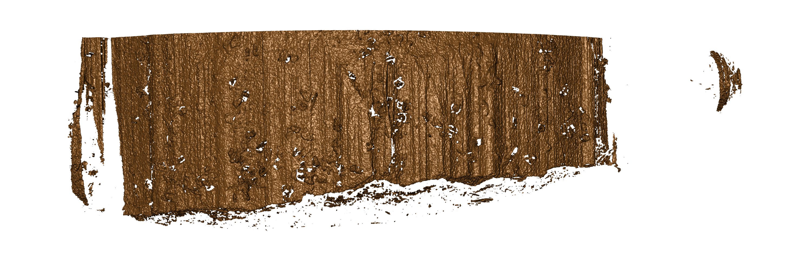<!-- -->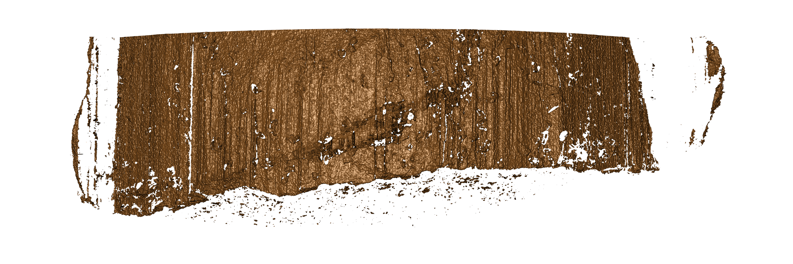<!-- -->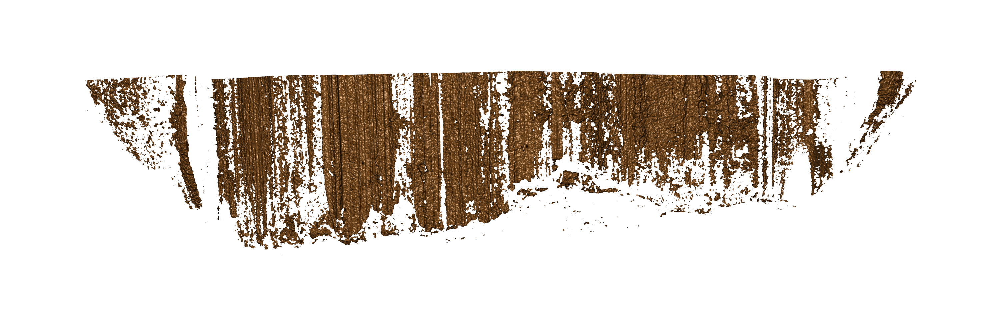<!-- -->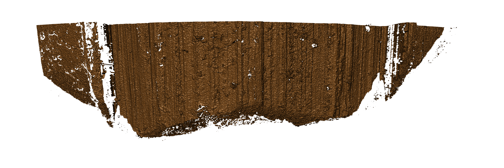<!-- -->

## Tank rash or pitting

This probably can’t be completely helped, as it’s an artifact of the
bullet itself, but here’s what it looks like anyways:
